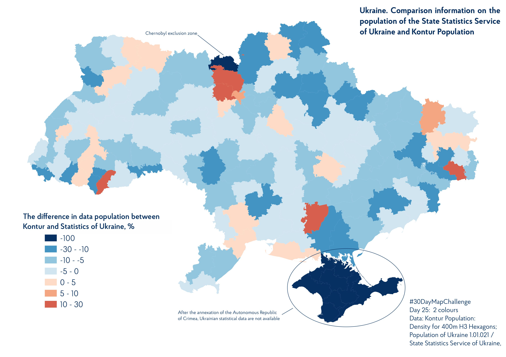

# #30DayMapChallenge 2022

This repository contains maps that were created during #30DayMapChallenge in November 2022. During this difficult month of maps, I made 30 maps of various themes, given by this year's maps theme in [30DayMapChallenge](https://30daymapchallenge.com/). All in all, it was an interesting, challenging, energetic experience of map making and it was incredible. Thanks to all the participants of 2022, who inspired and gave good examples of maps.

*If you have questions, suggestions, and also for communication, you can use email: lejberyk.ua@gmail.com, [Linkedin](https://www.linkedin.com/in/oleksandr-leiberiuk-a92778215/), or [Twitter](https://twitter.com/leiberiuk)*

## So Day 1: Point

The map shows the dynamics of count urban settlements on the territory of Ukraine from the beginning of the 20th century until now.

The data used for the analysis are the census of Austria-Hungary in 1910 and Russian Empire in 1897 compared with modern data in 2021 [State Statistics Service of Ukraine. Population and migration](https://www.ukrstat.gov.ua/druk/publicat/kat_u/publnasel_u.htm).

---

## Day 2: Linie

We know roads in OSM because of their different types. However, they consist of various digitized parts that can be measured in meters. In map, we see a digital part of roads from OpenStreetMap.
Data: [OpenStreetMap](https://www.openstreetmap.org/#map=5/46.966/32.739)

---

## Day 3: Polygon

Cultural heritage is a great asset of the people, which can be seen with your own eyes. Objects of cultural heritage of the city of Chernivtsi are presented in the form of polygons. Having point data and information of polygons from OSM, built polygon map. More info about of cultural heritage of the of Chernivtsi of link https://arcg.is/0bDLf
Data: [OpenStreetMap](https://www.openstreetmap.org/#map=5/46.966/32.739) and [Chernivtsi City Council](https://mkip.gov.ua/files/pdf/Nacional_znachenia/%D0%A7%D0%B5%D1%80%D0%BD%D1%96%D0%B2%D0%B5%D1%86%D1%8C%D0%BA%D0%B0%20%D0%BE%D0%B1%D0%BB..pdf).

---

## Day 4: Green

On the map view a density of rural population in Ukraine in 2014. As we can see, the density of the rural population is uneven. This shows the specificity of the placement of the rural population in the territory of Ukraine and the long history of territorial development.
Data: [State Statistics Service of Ukraine. Population and migration](https://www.ukrstat.gov.ua/druk/publicat/kat_u/publnasel_u.htm)

---

## Day 5: Ukraine

A vivid example of the number of hostilities in Ukraine from February 24 to November 5, 2022.
Usually, fires are observed throughout the territory of Ukraine, but their intensity this year reflects the line of military conflict.

Data: [NASA FIRMS](https://firms.modaps.eosdis.nasa.gov/)

---

## Day 6: Network

Passenger flow of the Kyiv metro according to open data. There is the main transport for residents of the capital and not only within Kyiv. The capacity of which is almost total.

Data: [OpenStreetMap](https://www.openstreetmap.org/#map=5/46.966/32.739) and [Wikipedia](https://uk.wikipedia.org/wiki/%D0%9A%D0%B8%D1%97%D0%B2%D1%81%D1%8C%D0%BA%D0%B8%D0%B9_%D0%BC%D0%B5%D1%82%D1%80%D0%BE%D0%BF%D0%BE%D0%BB%D1%96%D1%82%D0%B5%D0%BD)

---

## Day 7: Raster

The map depicts the relief of the Dnistrovsky district. The district is characterized by a flat landscape located in the west of the district (Khotynska Height). Khotyn Heights is the highest flat area within Ukraine (the city of Berda - 515 m.)

Data: [SRTM](https://en.wikipedia.org/wiki/Shuttle_Radar_Topography_Mission)

---

## Day 8: OpenStreetMap

Центр Івано-Франківська із його закладами харчування. Проаналізована інформація отримана із останнього вивантаження [Geofabric](https://download.geofabrik.de/).
Data: [OpenStreetMap](https://www.openstreetmap.org/#map=5/46.966/32.739)

---

## Day 9: Space

Spaceports with documented launches of satellites that have been launched into orbit

Data: [Wikipedia](https://en.wikipedia.org/wiki/Spaceport)

---

## Day 10: A bad map

The map has bad base data or an error. I am sure of it.

Data: [Natural Earth 1:10m Cultural Vectors](https://www.naturalearthdata.com/downloads/10m-cultural-vectors/)

---

## Day 11: Red

Distribution of toponyms "red" on the territory of Ukraine

Data: [OCHA Field Information
Services Section (FISS)](https://data.humdata.org/organization/ocha-fiss)

---

## Day 12: Scale

I trie to compaire a teritory of liberty Ukraine force in November in Right Bank of Dnipro in Kherson region and size the terittory of Sardynia (Italy), Georgia (Sakarvelo) and Belgium.

Data: Institute for the Study of War
and AEI's Critical Threats Project, [OpenStreetMap](https://www.openstreetmap.org/#map=5/46.966/32.739)
@theStudyofWar @CriticalThreats

---

## Day 13: 5 minute map

The map was created in a little more than 5 minutes. But I tried to do it in time. And the map has a 5-minute isochron of availability, thanks to ORS Tools. For such tasks, you should have ready, "hot" data)

Data: ORS Tools ([openrouteservice](https://openrouteservice.org/)),
[OpenStreetMap](https://www.openstreetmap.org/#map=5/46.966/32.739)

---

## Day 14: Hexagons

This is an estimate of the forest cover of the western regions of Ukraine (percentages).

Data: [OpenStreetMap](https://www.openstreetmap.org/#map=5/46.966/32.739)

---

## Day 15: Food/drink

I couldn't make a map yesterday due to the lack of electricity. Russia again attacked Ukraine with missiles. An analysis of the location of large shopping supermarkets in the city of Kyiv shows that there are many of them, it is difficult to determine the leaders as such, but ATB is the favorite if you know what I mean) To find zones for opening new ones, it will be necessary to analyze a lot of data.
Data: [OpenStreetMap](https://www.openstreetmap.org/#map=5/46.966/32.739) and tools QuickOSM

---

## Day 16: Minimal

Slavutych is the youngest Ukrainian city. Accordingly, it has a minimum of years of history. Interestingly, the city is located in Chernihiv Oblast, subordinate to Kyiv Oblast. And the energy workers who live here that had to commute through the territory of Belarus to get to work (at the Chornobyl NPP).

Data: [OpenStreetMap](https://www.openstreetmap.org/#map=5/46.966/32.739)

---

## Day 17: A map without a computer

I understand that this map should look better.

Data: "Ukraine in Maps" book

---

## Day 18: Blue

For some reason, I immediately associate blue with water, so the map is about precipitation. The amount of precipitation on the territory of Ukraine in 2021 is displayed here.

Data: [CRU (Climatic Research Unit)](https://crudata.uea.ac.uk/cru/data/hrg/),
[GISCO (Eurostat)](https://ec.europa.eu/eurostat/web/gisco/geodata)

---

## Day 19: Globe

The density of population in the countries of the world.

Data: [World Bank Data](https://databank.worldbank.org/home.aspx),
color: CARTOcolors,
tool: Globe Builder in QGIS

---

## Day 20: "My favorite ..."

It's hard to choose "My favourite ...". There are many possible options, but there will always be a place for the Carpathians.

Data: [SRTM](https://en.wikipedia.org/wiki/Shuttle_Radar_Topography_Mission), Syrotenko A., Chernov B.O. Geography of Ukraine

---

## Day 21: Kontur Population Dataset

I wanted to perform a massive data analysis with a specific region highlighted. But my notebook and time decided to take their time. Therefore such work in the future.

Data: [Kontur Population: Global Population Density for 400m](https://data.humdata.org/dataset/kontur-population-ukraine)

---

## Day 22: NULL

We all know about the complex relationship between polar bears and penguins. A map show this problem

Data: [data from the SCAR Antarctic Digital Database](https://data.bas.ac.uk/collections/e74543c0-4c4e-4b41-aa33-5bb2f67df389/), Globe Builder tool

---

## Day 23: Movement

If you look closely, in addition to fires, you can also see military operations. Data analysis from February to November 2022.
Війну можна побачити наівть з космосу.

Data: [NASA FIRMS VIIRS 375 m (NOAA-20)](https://firms.modaps.eosdis.nasa.gov/),
[GISCO (Eurostat)](https://ec.europa.eu/eurostat/web/gisco/geodata)

---

## Day 24: Fantasy

Day 24: Fantasy
Electricity in Ukraine is sometimes is, sometimes not. Thank you Russians, you are incredible barbarians! I tried to imagine how modern Lviv would look on Austro-Hungarian maps.
Data: [OpenStreetMap](https://www.openstreetmap.org/#map=5/46.966/32.739)

---

## Day 25: 2 colors

The difference in the data of the population of Kontur Population and the State Statistics Service of Ukraine.
We see that the data do not match, which is quite logical. But which data is more accurate? To understand this, you should dig deeper into the data.

Data: [Kontur Population: Global Population Density for 400m](https://data.humdata.org/dataset/kontur-population-ukraine); [State Statistics Service of Ukraine. Population and migration](https://www.ukrstat.gov.ua/druk/publicat/kat_u/publnasel_u.htm)

---

## Day 26: Island(s)

Ukraine is certainly not an island state, but you can find up to a hundred of them here аnd maybe more. On the map are islands at the mouth of the Danube, which are also located on the border between Romania and Ukraine.

Data: [OpenStreetMap](https://www.openstreetmap.org/#map=5/46.966/32.739)

---

## Day 27: Music

The map shows only a part of Ukrainian music festivals. There are much more, and I did not find a source that publishes their numbers.

Data: [Wikipedia](https://uk.wikipedia.org/wiki/%D0%A1%D0%BF%D0%B8%D1%81%D0%BE%D0%BA_%D1%84%D0%B5%D1%81%D1%82%D0%B8%D0%B2%D0%B0%D0%BB%D1%96%D0%B2_%D0%B2_%D0%A3%D0%BA%D1%80%D0%B0%D1%97%D0%BD%D1%96)

---

## Day 28: 3D

The picture shows the Black Mountain Range (Chornohora) in the Carpathian of Ukraine. You can see the highest peak with more than 2000 m.

Data: [SRTM](https://en.wikipedia.org/wiki/Shuttle_Radar_Topography_Mission), Qgis2threejs, 3D-models

---

## Day 29: "Out of my comfort zone"

I tried to make a map with the d3 library on JS. Information on GDP per capita from the World Bank served as data.

Date: [World Bank Data](https://databank.worldbank.org/home.aspx)

---

## Day 30: Remix

I want to change a lot on my maps, but I changed the map from day 1. Change of the city network 1897-2021.

Date: own information

